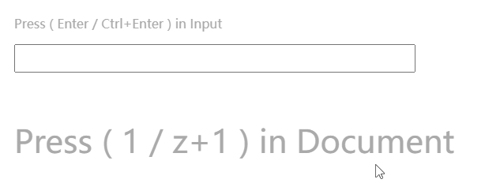

# 任意组合键 AnyCombinationKeys



---


**监听"任意"两个按键，作为组合键。**

_原生JavaScript，不依赖任何库。_

**Listens to "any two keys" as a key combination.**

_Uses JavaScript, does not depend on any libraries._

---

## Get Started

```
<!-- include AnyCombinationKeys.min.js-->
<script src="../dist/AnyCombinationKeys.min.js"></script>
```

## Usage

HTML

```
<input id="input" type="text">
```

JavaScript

```
const inputElement = document.querySelector('input');

anyCombinationKeys(inputElement, {
    interval: 250,                      // 主副按键按下的最大时间间隔
    key: 49,                            // 绑定主按键的键代码
    combinationKey: 16,                 // 绑定副按键的键代码
    onKey: function() {                 // 主按键按下时触发的回调函数
        console.log("onKey")
    },
    onCombinationKey: function() {      // 组合键按下时触发的回调函数
        console.log("onCombinationKey")
    }
});
```
