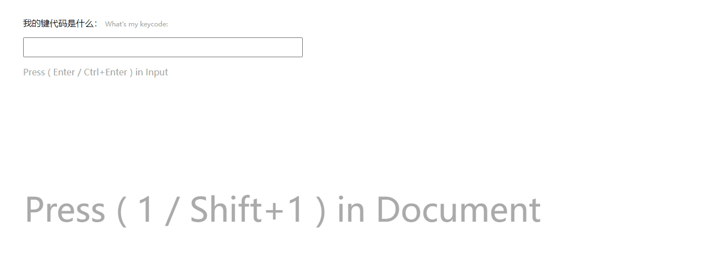

# compositeKey



绑定元素按下Enter或按下Ctrl+Enter的事件，或者绑定任意两个按键

*依赖Jquery*

Bind DOM Press enter or press enter with ctrl,or bind any other two keys

*require jquery*

*本插件没有使用计时器，转而使用了一种奇怪的方法.

## Get Started

```
<!-- include jQuery -->
<script type="text/javascript" src="https://libs.baidu.com/jquery/1.9.1/jquery.min.js"></script>

<!-- include compositeKey.js-->
<script type="text/javascript" src="/dist/compositeKey.js"></script>
```

## Usage

HTML

```
<input type="text">
```

JS(所有可选参数)

```
$("input").submitWithCtrl({      //绑定元素，$(document)为绑定全局
  key:49,                        //主热键，键代码。默认：13（回车Enter键）
  compositeKey: 16,              //副热键，键代码。默认：17（Ctrl键）
  interval:250,                  //副键按下后延迟多少ms后失效。默认：250
  onKey: function() {            //回调，当主按键被按下。默认：空
    $("#documentOnKey").text("document onKey 主按键被按下");
  },
  onCompositeKey: function() {   //回调，当主、副按键一起被按下。默认：空
    $("#documentOnKey").text("document onCompositeKey 组合键被按下");
  }});
```
